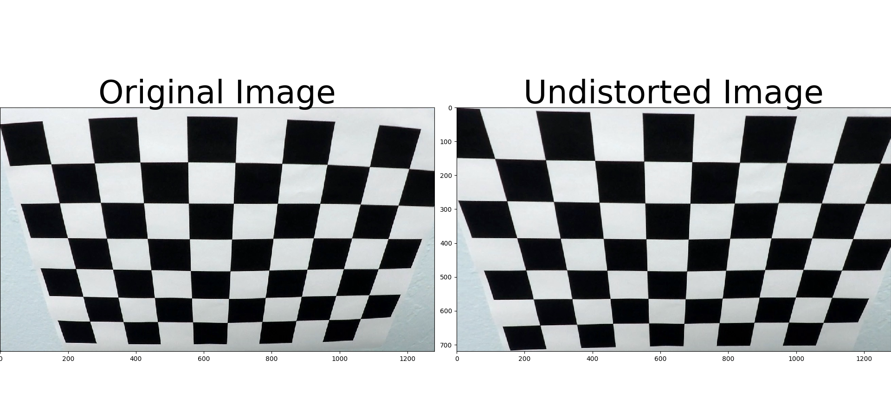

**Advanced Lane Finding Project**

The goals / steps of this project are the following:

* Compute the camera calibration matrix and distortion coefficients given a set of chessboard images.
* Apply a distortion correction to raw images.
* Use color transforms, gradients, etc., to create a thresholded binary image.
* Apply a perspective transform to rectify binary image ("birds-eye view").
* Detect lane pixels and fit to find the lane boundary.
* Determine the curvature of the lane and vehicle position with respect to center.
* Warp the detected lane boundaries back onto the original image.
* Output visual display of the lane boundaries and numerical estimation of lane curvature and vehicle position.

### Here I will consider the rubric points individually and describe how I addressed each point in my implementation.  
---

### Writeup / README

### Camera Calibration

#### 1. Briefly state how you computed the camera matrix and distortion coefficients. Provide an example of a distortion corrected calibration image.

Before the camera can be calibrated, it needs _object points_ and _image points_. This is implemented in the `calibrate_camera` function.

The first step is to calibrate the camera to compute the camera matrix and distortion cofficients. In order to go about doing this, 20 images of chessboards are provided. These images of chessboards are assumed to be one a fixed plane at z=0. This means that the objects points are all the same for each of the images.

Image points are obtained for each successful chessboard detection via `cv2.findChessboardCorners()`. These are the results:


Unfilled images means that there wasn't a successful chessboard detection. Once we obtain a list of object points and image points, we can use this to calibrate the camera using `cv2.calibrateCamera()`. This gives us the camera matrix and distortion coefficients.

### Pipeline (single images)

#### 1. Provide an example of a distortion-corrected image.

In order to undistort the image, both the camera matrix and distortion cofficients obtained from the calibration camera step are used with `cv2.undistort()`. To demonstrate this step, I will describe how I apply the distortion correction to one of the test images like this one:

Applied on one of the chessboard calibration images:



Applied on a test image:


After undistortion, the image becomes


The differences between both images are visualized below:


#### 2. Describe how (and identify where in your code) you used color transforms, gradients or other methods to create a thresholded binary image.  Provide an example of a binary image result.

This is implemented in the `color_threshold` function.

I used a combination of color thresholds to detect whites and yellows resulting in a binary image. These are the steps:

1. A range of white colors are used to detect whites:

    ```python
    white_bgr_lower = np.array([100, 100, 200], dtype=np.uint8)
    white_bgr_upper = np.array([255, 255, 255], dtype=np.uint8)
    white_bgr_range = cv2.inRange(image, white_bgr_lower, white_bgr_upper)
    white_bgr = cv2.bitwise_and(image, image, mask=white_bgr_range)
    white_bgr = convert_to_binary(white_bgr)
    ```
    
This results in an image like this:


2. A similar process goes for yellows:

    ```python
    yellow_bgr_lower = np.array([84, 191, 200], dtype=np.uint8)
    yellow_bgr_upper = np.array([170, 255, 255], dtype=np.uint8)
    yellow_bgr_range = cv2.inRange(undistort, yellow_bgr_lower, yellow_bgr_upper)
    yellow_bgr = cv2.bitwise_and(undistort, undistort, mask=yellow_bgr_range)
    yellow_bgr = convert_to_binary(yellow_bgr)
    ```


3. A HLS image is obtained from the undistorted image. Using the lower and upper ranges 
of both yellow and white, a mask is obtained. This mask is applied onto the original
image:
  
    ```python
    hls = cv2.cvtColor(undistort, cv2.COLOR_BGR2HLS)
    yellow_lower = np.array([20, 100, 100], dtype=np.uint8)
    yellow_upper = np.array([40, 200, 255], dtype=np.uint8)
    yellow_range = cv2.inRange(hls, yellow_lower, yellow_upper)

    white_dark = np.array([0, 0, 0], dtype=np.uint8)
    white_light = np.array([0, 0, 255], dtype=np.uint8)
    white_range = cv2.inRange(hls, white_dark, white_light)
    yellows_or_whites = yellow_range | white_range

    hls = cv2.bitwise_and(undistort, undistort, mask=yellows_or_whites)
    hls = cv2.cvtColor(hls, cv2.COLOR_HLS2BGR)
    hls = convert_to_binary(hls)
    ```
    


4. Finally, all three thrssholds are used that results in the final image:

    ```python
    combined_binary = np.zeros_like(hls)
    combined_binary[(hls == 1) | (white_bgr == 1) | (yellow_bgr == 1)] = 1
    ```
    

    
   

#### 3. Describe how (and identify where in your code) you performed a perspective transform and provide an example of a transformed image.

The code for my perspective transform includes a function called `warp_image()`. Here's the implementation:

    ```python
    src = np.array((
        [[576, 461],
         [706, 461],
         [1117, h],
         [194, h]
         ]), dtype=np.float32)

    offset = 250
    dst = np.array([
        [offset, 0],
        [w - offset, 0],
        [w - offset, h],
        [offset, h]], dtype=np.float32)

     M = cv2.getPerspectiveTransform(src, dst)
     warped = cv2.warpPerspective(threshold, M, (w, h))
     MInv = cv2.getPerspectiveTransform(dst, src)
     ```
  
In order to get the points for `src`, I used an image with straight lane lines:


and used points that corresponded to lthe lane markings on each side of the road which are the nearest and furthest from the camera:


`dst` represents the destination points. Since the lane markings are straight lines, the destination points should roughtly be a rectangle.

I verified that my perspective transform was working as expected by drawing the `src` and `dst` points onto a test image and its warped counterpart to verify that the lines appear parallel in the warped image:


#### 4. Describe how (and identify where in your code) you identified lane-line pixels and fit their positions with a polynomial?

The logic to identify the lane-line pixels and fit their positions with a polynomial is in the `compute_best_fit` function.


These are the main steps involved:

1. A histogram is computed for the bottom half of the image.
2. Find the peaks of the histogram. These are the starting points of the left and right lane lines respectively.
3. Given a number of windows (here number of windows = 9) of a given height and width, pixel locations are extracted. 
4. For each window, if there are enough pixels in the window, then the pixel positions are recorded. Otherwise, the window is recentered and the process repeats.
5. The end result is a set of left and right points that represent lane pixels. 

#### 5. Describe how (and identify where in your code) you calculated the radius of curvature of the lane and the position of the vehicle with respect to center.

I did this in the `compute_curvature()` function. First, the polynomials are computed for both the left and right lanes:

  ```python
  # Define conversions in x and y from pixels space to meters
  ym_per_pix = 30.0 / 720  # meters per pixel in y dimension
  xm_per_pix = 3.7 / 700  # meters per pixel in x dimension

  # Fit new polynomials to x,y in world space
  left_fit_cr = np.polyfit(lefty * ym_per_pix, leftx * xm_per_pix, 2)
  right_fit_cr = np.polyfit(righty * ym_per_pix, rightx * xm_per_pix, 2)
  ```
  
Once the polynomials are computed, the radius of the curvature can be computed for both lanes:
  
  ```
  # Calculate the new radii of curvature
  left_curve_rad = ((1 + (2 * left_fit_cr[0] * y_eval * ym_per_pix + left_fit_cr[1]) ** 2) ** 1.5) / np.absolute(
      2 * left_fit_cr[0])
  right_curve_rad = ((1 + (2 * right_fit_cr[0] * y_eval * ym_per_pix + right_fit_cr[1]) ** 2) ** 1.5) / np.absolute(
      2 * right_fit_cr[0])
      
  ```
  
Now that we have the radius of the curvature in meters, we can compute the left position and right position of the vehicle:
  
  ```
  left_pos = (left_fit[0] * y_eval ** 2 + left_fit[1] * y_eval + left_fit[2])
  right_pos = (right_fit[0] * y_eval ** 2 + right_fit[1] * y_eval + right_fit[2])
  ```
  
Therefore, the middle position of the vehicle can be computed:
  
  ```
  middle_pos = (left_pos + right_pos) / 2.0
  mid_dist = binary_warped.shape[1] / 2.0 - middle_pos
  mid_dist_in_m = xm_per_pix * mid_dist
  ```

#### 6. Provide an example image of your result plotted back down onto the road such that the lane area is identified clearly.


I implemented this step in the function `color_lane()`.  Here is an example of my result on a test image:


---

### Pipeline (video)

#### 1. Provide a link to your final video output.  Your pipeline should perform reasonably well on the entire project video (wobbly lines are ok but no catastrophic failures that would cause the car to drive off the road!).

Here's a [link to my video result](./test_video_output/project_video.mp4)

---

### Discussion

#### 1. Briefly discuss any problems / issues you faced in your implementation of this project.  Where will your pipeline likely fail?  What could you do to make it more robust?

The pipeline does fairly well on the project video. However, it does poorly on both the challenge videos. There are a few reasons for this. For starters, the challenge videos feature more vehicles changing lanes (therefore obscuring lane markings), shadows, more curves and turns, and bright sunlight.

There are a few ways to get around this. First would be to preprocess the images and normalize the images. For this implementation, there is no preprocessing step except for undistorting the images and applying a region of interest mask.

This implementation also doesn't keep the results of previous findings, nor does it have any notion of "confidence" when computing polynomials. For example, a nonsensical result where the left and right lane both curves in different directions should not be accepted. Therefore, previous valid results can be saved and used to compute the current curvature should the current computation yield an unsatisfactory result.
