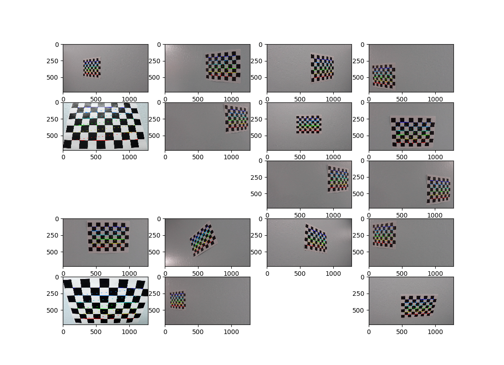

**Advanced Lane Finding Project**

The goals / steps of this project are the following:

* Compute the camera calibration matrix and distortion coefficients given a set of chessboard images.
* Apply a distortion correction to raw images.
* Use color transforms, gradients, etc., to create a thresholded binary image.
* Apply a perspective transform to rectify binary image ("birds-eye view").
* Detect lane pixels and fit to find the lane boundary.
* Determine the curvature of the lane and vehicle position with respect to center.
* Warp the detected lane boundaries back onto the original image.
* Output visual display of the lane boundaries and numerical estimation of lane curvature and vehicle position.

### Here I will consider the rubric points individually and describe how I addressed each point in my implementation.  
---

### Writeup / README

### Camera Calibration

#### 1. Briefly state how you computed the camera matrix and distortion coefficients. Provide an example of a distortion corrected calibration image.

Before the camera can be calibrated, it needs _object points_ and _image points_. This is implemented in the `calibrate_camera` function.

The first step is to calibrate the camera to compute the camera matrix and distortion cofficients. In order to go about doing this, 20 images of chessboards are provided. These images of chessboards are assumed to be one a fixed plane at z=0. This means that the objects points are all the same for each of the images.

Image points are obtained for each successful chessboard detection via `cv2.findChessboardCorners()`. These are the results:



Unfilled images means that there wasn't a successful chessboard detection. Once we obtain a list of object points and image points, we can use this to calibrate the camera using `cv2.calibrateCamera()`. This gives us the camera matrix and distortion coefficients.

### Pipeline (single images)

#### 1. Provide an example of a distortion-corrected image.

In order to undistort the image, both the camera matrix and distortion cofficients obtained from the calibration camera step are used with `cv2.undistort()`. To demonstrate this step, I will describe how I apply the distortion correction to one of the test images like this one:


After undistortion, the image becomes


The differences between both images are visualized below:


#### 2. Describe how (and identify where in your code) you used color transforms, gradients or other methods to create a thresholded binary image.  Provide an example of a binary image result.

This is implemented in the `color_and_gradient_threshold` function.

I used a combination of color and gradient thresholds to generate a binary image. These are the steps:

1. A grayscale image is obtained from the undistorted image.
2. A HLS image is obtained from the undistorted image. The S channel is isolated.
3. The first binary images is obtained by computing the Sobel gradient in the X direction, using the grayscale image. It is then thresholded as the following code snippet demonstrates:
  
  ```python
  sobelx = cv2.Sobel(gray, cv2.CV_64F, 1, 0)  # Take the derivative in x
  abs_sobelx = np.absolute(sobelx)  # Absolute x derivative to accentuate lines away from horizontal
  scaled_sobel = np.uint8(255 * abs_sobelx / np.max(abs_sobelx))
```
4. Another image is created by thresholding the S channel from step 2:

  ```python
  s_binary = np.zeros_like(s_channel)
  s_binary[(s_channel >= s_thresh[0]) & (s_channel <= s_thresh[1])] = 1
  ```

5. The two binary images are then combined:

  ```python
  combined_binary = np.zeros_like(gray)
  combined_binary[(s_binary == 1) | (sxbinary == 1)] = 1
  ```

Here's an example of my output for this step: 


In addition to color and gradient thresholding, I also implemented a `region_of_interest()` function to crop away unncessary areas of the image. Here's the output:


#### 3. Describe how (and identify where in your code) you performed a perspective transform and provide an example of a transformed image.

The code for my perspective transform includes a function called `warp_image()`. Here's the implementation:

  ```python
  src = np.array((
      [[607, 440],
        [670, 440],
        [1117, h],
        [194, h]
        ]), dtype=np.float32)

  offset = 250
  dst = np.array([
      [offset, 0],
      [w - offset, 0],
      [w - offset, h],
      [offset, h]], dtype=np.float32)

  M = cv2.getPerspectiveTransform(src, dst)
  warped = cv2.warpPerspective(threshold, M, (w, h))
  MInv = cv2.getPerspectiveTransform(dst, src)
  ```
  
In order to get the points for `src`, I used an image with straight lane lines:


and used points that corresponded to lthe lane markings on each side of the road which are the nearest and furthest from the camera:


`dst` represents the destination points. Since the lane markings are straight lines, the destination points should roughtly be a rectangle.

I verified that my perspective transform was working as expected by drawing the `src` and `dst` points onto a test image and its warped counterpart to verify that the lines appear parallel in the warped image:


#### 4. Describe how (and identify where in your code) you identified lane-line pixels and fit their positions with a polynomial?

The logic to identify the lane-line pixels and fit their positions with a polynomial is in the `compute_best_fit` function.


#### 5. Describe how (and identify where in your code) you calculated the radius of curvature of the lane and the position of the vehicle with respect to center.

I did this in the `compute_curvature()` function.

#### 6. Provide an example image of your result plotted back down onto the road such that the lane area is identified clearly.


I implemented this step in the function `color_lane()`.  Here is an example of my result on a test image:


---

### Pipeline (video)

#### 1. Provide a link to your final video output.  Your pipeline should perform reasonably well on the entire project video (wobbly lines are ok but no catastrophic failures that would cause the car to drive off the road!).

Here's a [link to my video result](./test_video_output/project_video.mp4)

---

### Discussion

#### 1. Briefly discuss any problems / issues you faced in your implementation of this project.  Where will your pipeline likely fail?  What could you do to make it more robust?

Here I'll talk about the approach I took, what techniques I used, what worked and why, where the pipeline might fail and how I might improve it if I were going to pursue this project further.  
